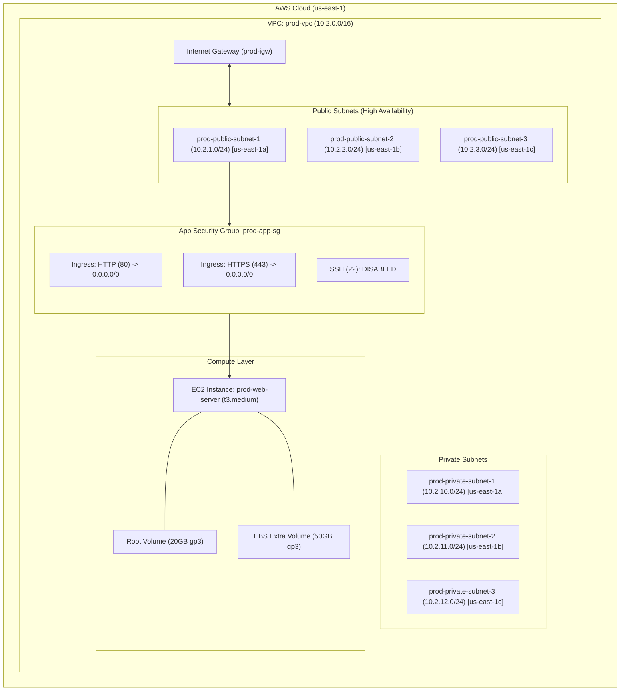

# Production Infrastructure Architecture

## Overview
The **Production Environment** is engineered for high availability, fault tolerance, and secure application delivery. It spans **3 AWS Availability Zones** (`us-east-1a`, `us-east-1b`, `us-east-1c`) with strict network boundaries and dedicated security guardrails.

---

## Architecture Diagram



---

## Component Specifications

### 1. Network Layer (`modules/vpc`)
* **VPC CIDR**: `10.2.0.0/16`
* **Availability Zones**: `us-east-1a`, `us-east-1b`, `us-east-1c`
* **Public Subnets**:
  * `10.2.1.0/24` (AZ-a)
  * `10.2.2.0/24` (AZ-b)
  * `10.2.3.0/24` (AZ-c)
* **Private Subnets**:
  * `10.2.10.0/24` (AZ-a)
  * `10.2.11.0/24` (AZ-b)
  * `10.2.12.0/24` (AZ-c)
* **Routing**: Public subnets route outbound `0.0.0.0/0` via `prod-igw`. Private subnets are isolated with standard private route table associations.

### 2. Security Layer (`modules/security_group`)
* **Security Group Name**: `prod-app-sg`
* **Ingress Rules**:
  * **HTTP (80)**: Allowed from `0.0.0.0/0`
  * **HTTPS (443)**: Allowed from `0.0.0.0/0`
  * **SSH (22)**: **Strictly Disabled from public access** (Enforces Systems Manager SSM / Bastion pattern)
* **Egress Rules**: Default egress allowed to `0.0.0.0/0`.

### 3. Compute & Storage Layer (`modules/ec2`)
* **Instance Type**: `t3.medium` (2 vCPU, 4 GiB RAM)
* **AMI**: Latest Amazon Linux 2023 (`al2023-ami-2023.*-x86_64`)
* **Root EBS Volume**: 20 GB `gp3`
* **Additional EBS Volume**: 50 GB `gp3` attached at `/dev/sdb` for production data persistence.

---

## Deployment & Variable Management

All environment configurations are clean and decoupled using `terraform.tfvars`.

### Commands

```bash
# Navigate to production directory
cd environments/prod

# Initialize Terraform modules and providers
terraform init

# Validate configuration structure
terraform validate

# Review execution plan using terraform.tfvars
terraform plan

# Apply infrastructure changes
terraform apply -auto-approve
```
