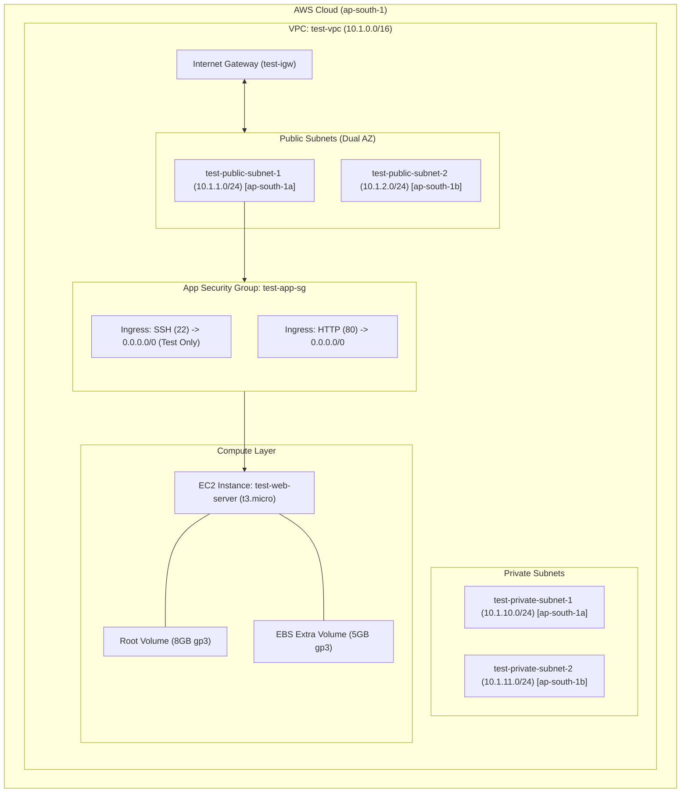

# Test Infrastructure Architecture

## Overview
The **Test Environment** is designed for cost efficiency, rapid testing, and developer access. It spans **2 AWS Availability Zones** (`ap-south-1a`, `ap-south-1b`) and enables SSH debugging access alongside standard HTTP ingress.

---

## Architecture Diagram



---

## Component Specifications

### 1. Network Layer (`modules/vpc`)
* **VPC CIDR**: `10.1.0.0/16`
* **Availability Zones**: `ap-south-1a`, `ap-south-1b`
* **Public Subnets**:
  * `10.1.1.0/24` (AZ-a)
  * `10.1.2.0/24` (AZ-b)
* **Private Subnets**:
  * `10.1.10.0/24` (AZ-a)
  * `10.1.11.0/24` (AZ-b)
* **Routing**: Public subnets route outbound `0.0.0.0/0` via `test-igw`.

### 2. Security Layer (`modules/security_group`)
* **Security Group Name**: `test-app-sg`
* **Ingress Rules**:
  * **SSH (22)**: Allowed from `0.0.0.0/0` for remote testing and setup.
  * **HTTP (80)**: Allowed from `0.0.0.0/0`.
* **Egress Rules**: Default egress allowed to `0.0.0.0/0`.

### 3. Compute & Storage Layer (`modules/ec2`)
* **Instance Type**: `t3.micro` (2 vCPU, 1 GiB RAM - Free Tier eligible / cost optimized)
* **AMI**: Latest Amazon Linux 2023 (`al2023-ami-2023.*-x86_64`)
* **Root EBS Volume**: 8 GB `gp3`
* **Additional EBS Volume**: 5 GB `gp3` attached at `/dev/sdb` for test data.

---

## Deployment & Variable Management

Environment values are cleanly parameterized in `terraform.tfvars`.

### Commands

```bash
# Navigate to test directory
cd environments/test

# Initialize Terraform modules and providers
terraform init

# Validate configuration structure
terraform validate

# Review execution plan using terraform.tfvars
terraform plan

# Apply infrastructure changes
terraform apply -auto-approve
```
