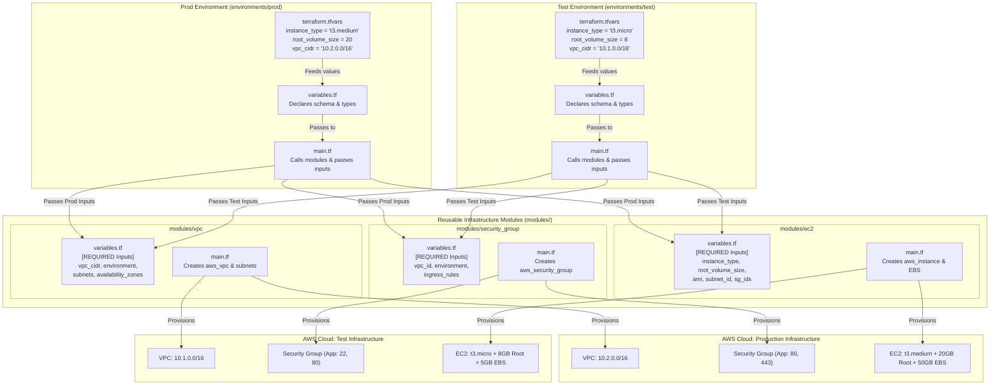

# Terraform Reusable Modules Architecture

## Overview
The `modules/` directory contains highly reusable, DRY (Don't Repeat Yourself), environment-agnostic Terraform modules. These modules abstract complex AWS resource creation into predictable, configurable building blocks.

---

## Module Interaction & Dataflow Diagram

---

## Detailed Module Contracts

### 1. `vpc` Module (`modules/vpc`)

#### Purpose
Configures custom Virtual Private Cloud infrastructure including Internet Gateways, variable public/private subnet counts across specified Availability Zones, and route tables.

#### Structure
* `main.tf`: VPC, IGW, public/private subnets with count loops, route tables & associations.
* `variables.tf`:
  * `environment`: Environment identifier tag (`string`, required)
  * `vpc_cidr`: Base CIDR block (`string`, required)
  * `public_subnet_cidrs`: List of public CIDRs (`list(string)`, required)
  * `private_subnet_cidrs`: List of private CIDRs (`list(string)`, required)
  * `availability_zones`: AZ alignment (`list(string)`, required)
  * `tags`: Map of additional resource tags (`map(string)`, optional)
* `outputs.tf`:
  * `vpc_id`: ID of the created VPC
  * `public_subnet_ids`: List of public subnet IDs
  * `private_subnet_ids`: List of private subnet IDs

---

### 2. `security_group` Module (`modules/security_group`)

#### Purpose
Generates modular AWS Security Groups with dynamic HCL block generation for ingress and egress rules.

#### Structure
* `main.tf`: `aws_security_group` with dynamic `ingress` and `egress` blocks.
* `variables.tf`:
  * `environment`: Environment identifier tag (`string`, required)
  * `name`: Security group naming prefix (`string`, required)
  * `description`: Purpose description (`string`, default: `"Managed by Terraform"`)
  * `vpc_id`: Associated VPC ID (`string`, required)
  * `ingress_rules`: List of rule maps (`list(object)`, optional)
  * `egress_rules`: List of rule maps (`list(object)`, optional)
* `outputs.tf`:
  * `security_group_id`: ID of the created Security Group

---

### 3. `ec2` Module (`modules/ec2`)

#### Purpose
Provisions EC2 compute instances with custom root volume configuration, optional secondary EBS volume creation, auto-attachment, and public IP mapping options.

#### Structure
* `main.tf`: `aws_instance`, optional `aws_ebs_volume`, and `aws_volume_attachment`.
* `variables.tf`:
  * `environment`: Environment tag (`string`, required)
  * `name`: Instance name tag (`string`, required)
  * `ami`: AMI ID (`string`, required)
  * `subnet_id`: Target subnet ID (`string`, required)
  * `security_group_ids`: List of SG IDs (`list(string)`, required)
  * `instance_type`: EC2 size (`string`, required - no default)
  * `root_volume_size`: Root volume size in GB (`number`, required - no default)
  * `root_volume_type`: Root disk type (`string`, default: `"gp3"`)
  * `create_additional_volume`: EBS toggle (`bool`, default: `false`)
  * `additional_volume_size`, `additional_volume_type`, `additional_volume_device_name`: EBS spec
* `outputs.tf`:
  * `instance_id`: ID of the EC2 instance
  * `public_ip`: Public IP address (if assigned)
  * `private_ip`: Internal IP address
  * `subnet_id`: Subnet ID where the EC2 instance is launched
  * `security_group_id`: Primary security group ID attached to the EC2 instance

